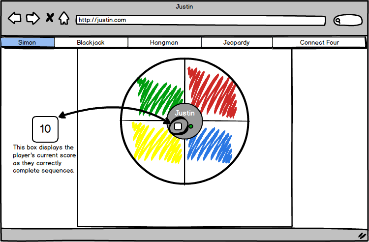
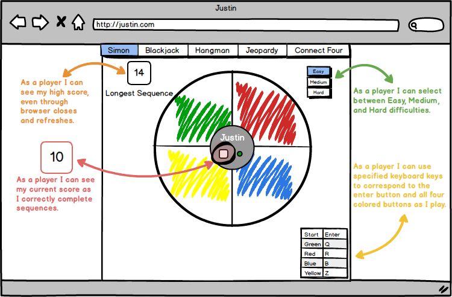

# WDI Project 1 - Simon

Project Link: Coming Soon!

## Overview

This is what I developed for the first project in General Assembly's Web Development Immersive.  I chose to do the Simon project because I felt I had some basic ideas on how I could put it together but knew it would challenge me at the same time.

## Technologies Used

* Languages - HTML5, CSS3, JavaScript
* Mockups - Balsamiq
* Project Planning & User Stories - Trello
* Text Editor - Sublime Text 3

## Features

* In Progress

## Build Process

### Mockups and Features

I created a mockup based around the basic features that I will implement in this project.  I've also created a mockup showing "bonus" features that I'd like to implement given time.

#### Basic Implemented Features:

* Buttons light up (change color) as the sequence is given to the player, and as the player presses the buttons in response.
* Each button makes a unique sound as the sequence is given and as the player presses the buttons.
* A special sound plays when the user makes a mistake.
* Score is kept as the player's correct sequence gets longer.

##### Basic Features Mockup:

---

#### Future Development:

* Store and display the player's longest successful sequence.
  - This would ideally be stored through browser refreshes and resets.
* Give player the ability to choose between "Easy", "Medium", and "Hard" difficulties.
  - This will affect the speed at which the player is given the pattern.
* Add the ability to play with corresponding keyboard keys rather than clicking.
  - Possible key bindings:
  | In-game button | Keyboard Key  |
  | -------------- | ------------- |
  | Start          | Enter         |
  | Green          | Q             |
  | Red            | R             |
  | Blue           | B             |
  | Yellow         | Z             |
* Recreate Simon's audio/visual pattern played when the game is turned on.
  - As seen in [this]() video. **(Video link coming soon.)**
* Create a mockup for a responsive/mobile design and implement that design.
  - This could involve stacked color divs or a basic four colored grid of divs.

##### Future Features Mockup:

