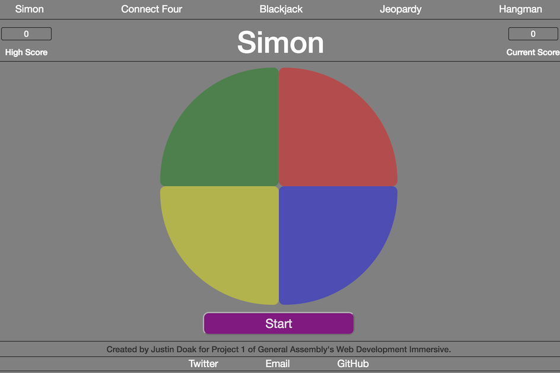
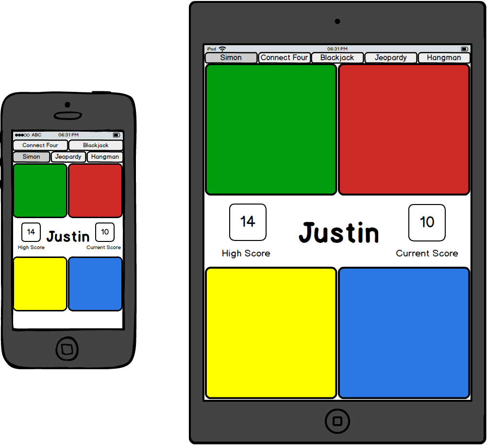
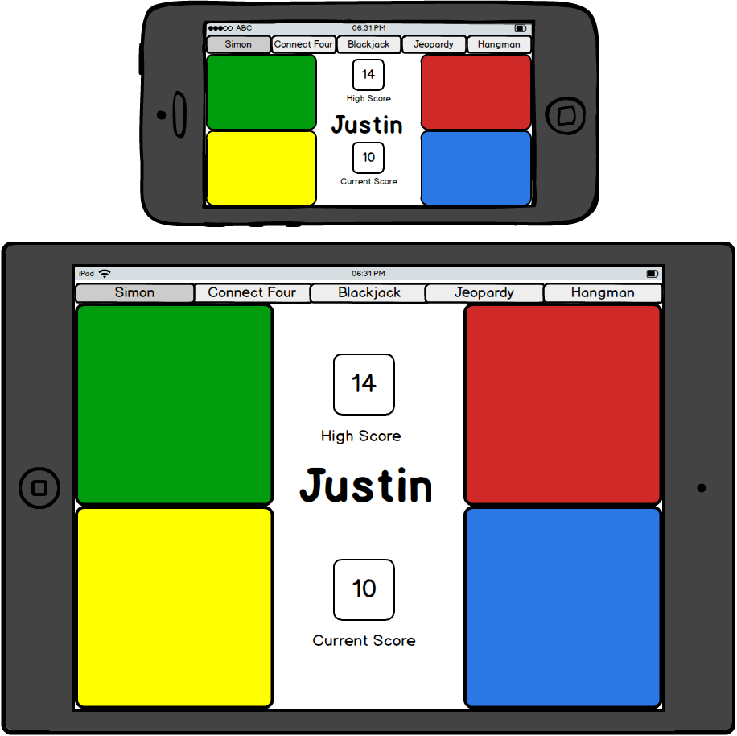

# WDI Project 1 - Simon

Project Link: [Simon](https://jhdoak.github.io/simon/)

Trello Board: [Trello Board](https://trello.com/b/4Rlr1nEX/wdi-project-1)

## Finished Product:



## Overview

This is what I developed for the first project in General Assembly's Web Development Immersive.  I chose to do the Simon project because I felt I had some basic ideas for implementation but knew it would challenge me at the same time.

## Technologies Used

* Languages - HTML5, CSS3, JavaScript
* Frameworks - Bootstrap for basic formatting
* CSS: Flexbox for layout and item order, CSS media queries for responsiveness.
* Mockups - Balsamiq
* Project Planning & User Stories - Trello
* Text Editor - Sublime Text 3

## Features

* Game buttons light up and play corresponding sounds on player click and during sequence playback.
* Losing sound plays on incorrect presses.
* Game keeps track of player's score throughout the game.
* Game keeps track of player's high score.
  - Note: See 'Future Development'
* Start button toggles to a reset button during gameplay, which resets the game and restarts.
  - Note: See 'Future Development'
* Game buttons are disabled during sequence playback to ensure the player doesn't play out of turn.

## Build Process

### Mockups and Features

I created a mockup based around the basic features that I will implement in this project.  I've also created a mockup showing "bonus" features that I'd like to implement given time.

I decided to approach this build with a "mobile-first" mindset.  I've read about the benefits of this mindset, and thought it might help me focus on creating a smooth, functional, small-scale product that I could (ideally) expand for larger screens without too much hassle. I created two mobile mockups showing what the final product might look like on smaller and larger mobile devices in both portrait and landscape.  I look forward to seeing how this approach turns out.

I also decided to build this game with vanilla javascript alone.  A member of a past WDI cohort reccommended I make sure to be comfortable with DOM manipulation and programming with vanilla javascript before using libraries like jQuery.  I feel this approach helped me with my understand of DOM manipulation, and now that I have a better understanding I look forward to seeing how jQuery could make my code more efficient and clean.  Given time I could revisit this project and rewrite the code using jQuery.

#### Basic Implemented Features:

* Buttons light up (change color) as the sequence is given to the player, and as the player presses the buttons in response.
* Each button makes a unique sound as the sequence is given and as the player presses the buttons.
* A special sound plays when the user makes a mistake.
* Score is kept as the player's correct sequence gets longer.

##### Basic Features Mockup:


#### Mobile Mockups:



---

### Production Issues:

The first time I really felt "stuck" was with an issue regarding sequence playback.  The game would correctly push a random value to the sequence, but instead of changing the opacity of ("lighting up") each button in sequence, it did so for each button present in the sequence at the same time.  My code looked something like this:

```javascript
for (var i = 0; i < this.sequence.length; i++) {
    this.lightUpAndSound(this.sequence[i], game.playerCorrect);
}
```

I needed some sort of delay as the for loop iterated through the sequence and called my `lightUpAndSound` method.  I tried a few implementations of the `setTimeout` function, but it broke "this" within that function and other methods called within that function.  I repaired this by using, for example, `game.lightUpAndSound` instead of `this.lightUpAndSound`, which fixed that particular issue, but then gave me null errors when trying to manipulate the DOM and set attributes within the called method.  At this point I didn't have many ideas, so I got some help from Dr. Mike, who helped me implement a `delayedPlay` method, as seen here:

```javascript
delayedPlay: function(num, delay) {
  setTimeout(function() {
    game.lightUpAndSound(game.sequence[num], game.playerCorrect);
  }, delay);


for (var i = 0; i < this.sequence.length; i++) {
    this.delayedPlay(i, i * 1000);
}
},
```

With this solution, as the game iterates through the sequence it calls the `delayedPlay` method, passing in the index as one argument, and passing in that index * 1000 as a delay.  Thus, the `lightUpAndSound` method is called immediately for the first item in the sequence, and in 1000ms increments for each item thereafter.  The duration of this delay can be altered by changing the multiplier passed in to `delayedPlay`.

Additionally, with `setTimeout` and the desired `lightUpAndPlay` method inside the `delayedPlay` method, `this` was preserved within other methods of `game`.  This solution provides great, flexible functionality while minimizing the amount of editing necessary at other places in the code.  I'm sure I'll come back to this strategy quite often in the future when I need to take timing and delay into account.

---

#### Future Development:

* Rewrite javascript code with jQuery.
* Give player the ability to choose between "Easy", "Medium", and "Hard" difficulties.
  - This will affect the speed at which the player is given the pattern.
  - An alternative to this would be to implement an increase in speed at different points during the sequence rather than giving difficulty choices to the player. For example, sequence playback could start at a standard rate and increase each time the sequence hits a multiple of 5.
* Store and display the player's longest successful sequence through browser refreshes and resets.
* Add the ability to play with corresponding keyboard keys rather than clicking.
  - Possible key bindings:

    | In-game button | Keyboard Key  |
    | -------------- | ------------- |
    | Start          | Enter         |
    | Green          | Q             |
    | Red            | R             |
    | Blue           | B             |
    | Yellow         | Z             |

* Recreate Simon's audio/visual pattern played when the game is turned on.
  - As seen in [this](https://youtu.be/1Yqj76Q4jJ4?t=7s) video.

##### Future Features Mockup:


